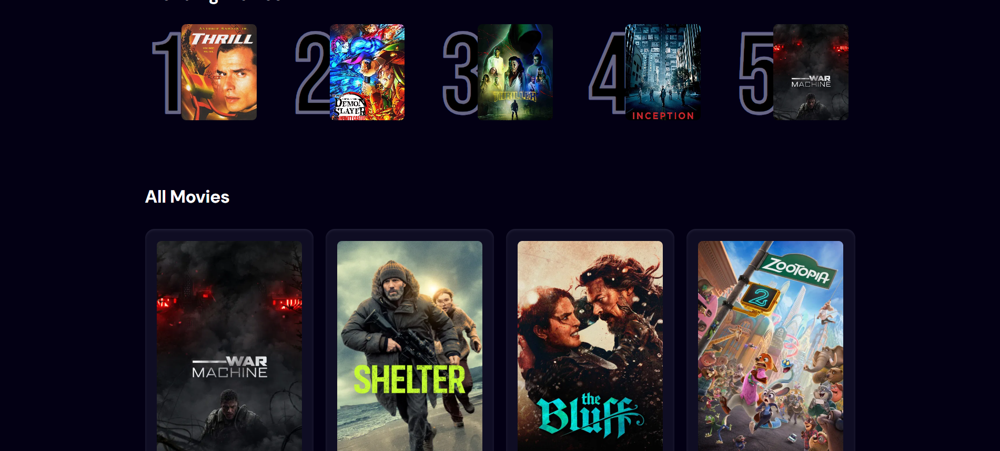
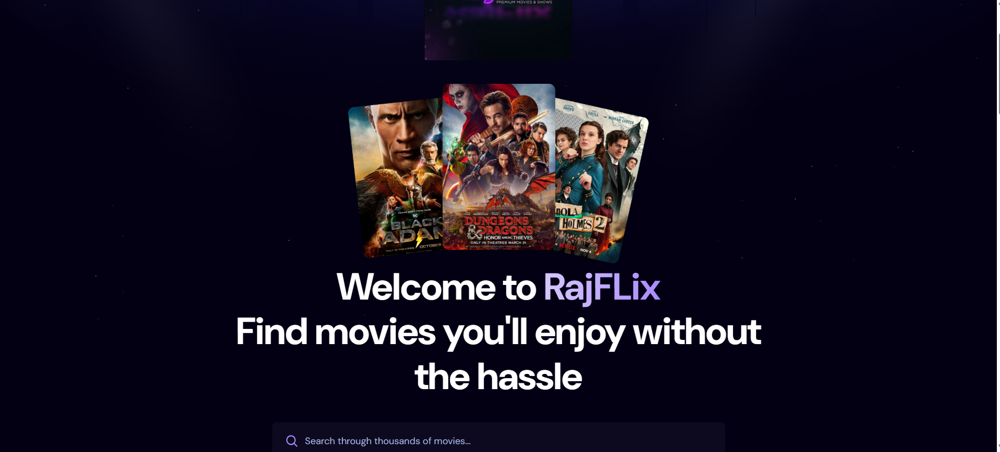
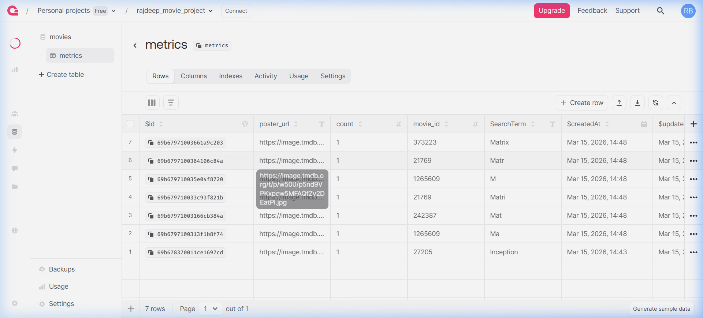

# RajFLix

RajFLix is a modern, responsive movie discovery application built with React and Vite. It allows users to search for their favorite movies and keeps track of trending searches using an Appwrite database backend.

## Features
- **Movie Search**: Search for any movie using the TMDB API.
- **Trending Movies**: See what others are searching for most often, powered by Appwrite Database.
- **Modern UI**: Stylish, responsive design.

## Screenshots

### Frontend




### Appwrite Database Backend


## Tech Stack
- Frontend: React (Vite), Tailwind CSS
- Backend/Database: Appwrite
- APIs: The Movie Database (TMDB)

## Setup instructions

Create a `.env.local` file with the following keys:
```env
VITE_TMDB_API_KEY=your_tmdb_key
VITE_APPWRITE_PROJECT_ID=your_appwrite_project_id
VITE_APPWRITE_DATABASE_ID=your_appwrite_database_id
VITE_APPWRITE_TABLE_ID=your_appwrite_collection_id
```

Run the development server:
```bash
npm install
npm run dev
```
